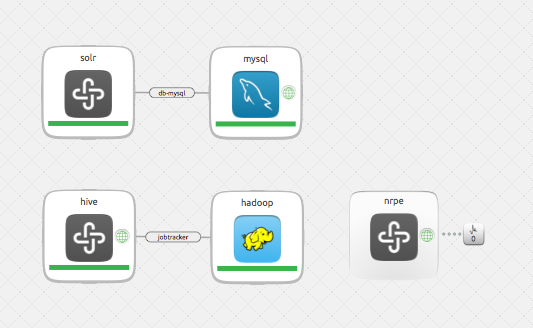

  - Entry: Data Science / Data Mining - represents a full stack of data mining and “big data” analysis.

  - this charm is called bigdata. It includes the following charms:
    - hadoop with hbase and pig enabled
    - hive
    - mysql
    - solr
    - nagios nrpe

  - to deploy:

juju bootstrap
sleep 180
juju-deployer -c bigdata.yaml bigdata
juju status

