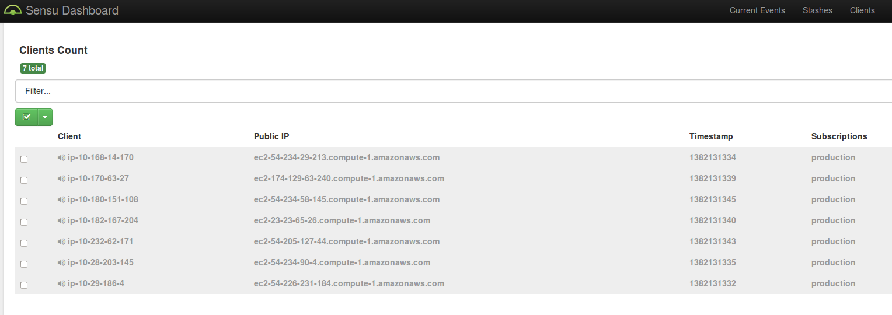

# Monitoring Stack

This Juju Deployment will build a full monitoring and logging stack for your environment.

It has been tested in Amazon EC2,  but should work in any environment.

## The following Applications will be Installed and configured


* Juju
* -- bootstrap node
* -- juju GUI
* Queuing
* -- RabbitMQ
* Logging
* -- Elasticsearch
* -- Kibana
* -- Logstash Server
* -- Logstash Agent(s) on all machines
* Monitoring
* -- Graphite
* -- Sensu Server
* -- Sensu Agent(s) on all machines

If you are building your whole environment in juju you can simply add the logstash agent and sensu agent
subordinate charms to any system you want to monitor.   Logstash agent is set up to look for common log directories for sensu, nginx, and apache and should start collecting their logs.  

If you have servers outside of the juju deployment you can install the logstash agent or sensu agent on those servers
and set them to send their data to the public port of the RabbitMQ server.

Between the server startup time and getting all the dependencies hooked together,  don't be surprised if it takes 15mins or more before kibana and sensu/graphite start seeing good data.

## To Deploy

First clone this repo

```
git clone https://github.com/paulczar/charm-championship.git monitoringstack
cd monitoringstack
```

Use one of the two following methods to kick off the deployment.

### Juju Deployer

The following *should* work,  however I've encountered several bugs in the juju tools.  Some appear to have been fixed,  but still not getting consistently reliable results.    I recommend you use the other method.


```
sudo pip install juju-deployer
juju bootstrap
juju-deployer -c monitoringstack.yaml monitoringstack
# Looks like juju-deployer doesn't expose services ?
juju expose sensu-server
juju expose graphite
juju expose kibana
juju expose rabbit
juju expose juju-gui
```

#### Bugs that I found when trying to use this method

* [juju-gui export and subordinate charms bug](https://bugs.launchpad.net/juju-core/+bug/1240708).
* -- Has been resolved.
* [juju-gui export doens't save exposed ports bug](https://bugs.launchpad.net/juju-gui/+bug/1241782).
* [juju-deployer never completes deployment bug](https://bugs.launchpad.net/juju-deployer/+bug/1241721).
* -- Appears to be intermittant ...  YMMV
* -- I've also experienced where services don't actually start using this method.  

### Juju CLI tools


The following shell script deploys the same stack via the juju CLI tools and is not affected by the bugs above. I'm deploying
the juju-gui as part of it,  so the gui can give a graphical representation of the results as well as be used to further modify the deployment if pointing and clicking is your thing.


```
sh monitoringstack.sh
```

## To access

`juju status` can be a little hard to read when there's a lot of services,  so I wrote a shell script to find and display the hostname/urls needed to access the various dasbhoards.  It is a fairly primitive and may not parse correctly until all services are up.

If you're using a decent terminal you should even be able to click on the resultant URLs.

```
sudo pip install shyaml
./show-services
```

Below is the easiest way I could think of to represent how to find the hostnames/URLs by eyeballing the `juju status` output.

### Kibana   


#### Basic Dashboard
http://`services => kibana => public-address`:80

#### Web site statistics
http://`services => kibana => public-address`/index.html#/dashboard/file/web.json

### Sensu



http://`services => sensu-server => public-address`:8080

* username: admin
* password: secret

### Graphite 


#### Base Graphite Web

http://`services => graphite => public-address`:80

#### Graphlot graph plotting cpu.user across all systems

http://`services => graphite => public-address`/graphlot/?from=-1hour&until=-0hour&target=stats.*.cpu.user

## Caveats

### This deployment is not HA.   To make it fully HA you would need to do the following

* Add more Elasticsearch units
* -- easy if in amazon,  can use EC2 discovery for auto-clustering
* -- if you have luxury of multicast it should just work
* -- there's some experimental config options ( ZENMASTERS ) which should work for unicast discovery, but not well tested.
* Add more RabbitMQ units ( I haven't tested the clustering,  but the charm looks like it supports it )
* Add a redundant Logstash Server ( or just have a script to start a new one if existing fails )
* Add a redundant Sensu Server ( or just have a script to start a new one if existing fails )
* Add a redundant Kibana Server and put a LB in front ( or just have a script to start a new one if existing fails )
* Add support to Graphite charm to be HA and then add more Graphite units

### No alerting

* I didn't want to alert by default, because I don't know how you like to alert.
* Pretty simple to set up Sensu to alert via email or via PagerDuty API