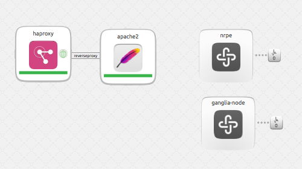

2 bundles:

  - 1. Entry: Data Science / Data Mining - represents a full stack of data mining and “big data” analysis.

  - this charm bundle is called bigdata. It includes the following charms:
    - hadoop with hbase and pig enabled
    - hive
    - mysql
    - nagios nrpe

  - to deploy:

juju bootstrap

sleep 180

juju-deployer -d -v -c bigdata.yaml envExport

juju status

  - 2. Entry: HA of the apache2 service.

  - this charm bundle is called ha_apache. It includes the following charms:
    - apache2
    - haproxy
    - nagios nrpe
    - ganglia node

  - to deploy:

juju bootstrap

sleep 180

juju-deployer -d -v -c ha_apache.yaml envExport

juju status

ssh haproxy_public_address

sudo vi /etc/haproxy/haproxy.cfg

in a listen section, add a server statement using apache public address from juju status above like this:

listen http_proxy 172.31.41.72:80
    balance roundrobin
    server www0 54.200.214.90 weight 1 maxconn 2048 check inter 2000 cookie www0

